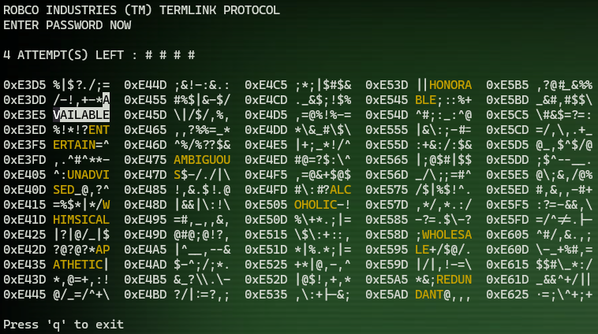

# RobCo Industries Hacking Game

[](https://github.com/Galfurian/robco_industries_hacking/actions/workflows/ubuntu.yml)
[](https://github.com/Galfurian/robco_industries_hacking/actions/workflows/macos.yml)
[](https://github.com/Galfurian/robco_industries_hacking/actions/workflows/documentation.yml)

Welcome to the **RobCo Industries Hacking Game**, an NCurses-based terminal game inspired by the hacking mechanic from the Fallout series. Test your deduction skills by guessing the correct word from a scrambled list within a limited number of attempts.

## Features

- **Interactive Gameplay**: Navigate through panels of scrambled text and make your guess.
- **Color-Coded Feedback**:
  - Selected words are highlighted.
  - Incorrect guesses remain visible in a distinct color.
- **Word Similarity Feedback**: After each incorrect guess, see how many letters matched the correct solution.
- **Randomized Layout**: Every game generates a unique set of scrambled words and panels.
- **Customizable Parameters**: Adjust the number of panels, rows, columns, and words via command-line arguments.

## Gameplay

1. **Objective**: Find the correct password hidden among scrambled words.
2. **Navigation**:
   - Use the arrow keys to move the cursor.
   - Press `Enter` or `Mouse Click` to select a word.
3. **Feedback**:
   - Correct guesses win the game.
   - Incorrect guesses reduce your attempts and show matching letters.
4. **Game Over**: The game ends when you either guess the correct word or run out of attempts.

## Installation

### Prerequisites

- A C++ compiler supporting C++17 or later.
- NCurses library installed on your system.

#### Install NCurses on Linux:
```bash
sudo apt install libncurses5-dev libncursesw5-dev
```

#### Install NCurses on macOS:
```bash
brew install ncurses
```

### Build Instructions

1. Clone the repository:
   ```bash
   git clone https://github.com/username/robco-hacking-game.git
   cd robco-hacking-game
   ```

2. Create a `build` directory and navigate into it:
   ```bash
   mkdir build && cd build
   ```

3. Build the project:
   ```bash
   cmake ..
   make
   ```

4. Run the game:
   ```bash
   ./robsec --dictionary ../data/words.txt -p 4 -r 15 -c 15 -w 15
   ```

## Command-Line Arguments

The game accepts several configuration options via the command line:

| Argument              | Alias | Default | Description                         |
|-----------------------|-------|---------|-------------------------------------|
| `--dictionary`        | `-d`  | None    | Path to the dictionary file.        |
| `--panels`            | `-p`  | 3       | Number of panels.                   |
| `--rows`              | `-r`  | 20      | Number of rows per panel.           |
| `--columns`           | `-c`  | 12      | Number of columns per panel.        |
| `--words`             | `-w`  | 12      | Number of words to guess.           |
| `--attempts`          | `-a`  | 4       | Number of attempts allowed.         |

### Example

To run the game with a custom configuration:
```bash
./robsec --dictionary ../data/words.txt -p 4 -r 15 -c 15 -w 15
```

## Key Bindings

| Key          | Action                  |
|--------------|-------------------------|
| Arrow Keys   | Navigate through panels |
| Enter        | Select a word           |
| q            | Quit the game           |

## Code Structure

- **`game.hpp`**: Contains the game logic, structures, and rendering functions.
- **`main.cpp`**: Initializes the game and handles execution flow.
- **`utils.cpp`**: Helper functions for random number generation, string manipulation, etc.

## Known Issues

- Transparent background support may vary depending on the terminal emulator.
- Mouse functionality is not supported on all terminals.

## License

This project is currently unlicensed.

## Acknowledgments

- Inspired by the hacking mechanic from the Fallout series.
- Built with the NCurses library for terminal-based UI.

## Screenshots



